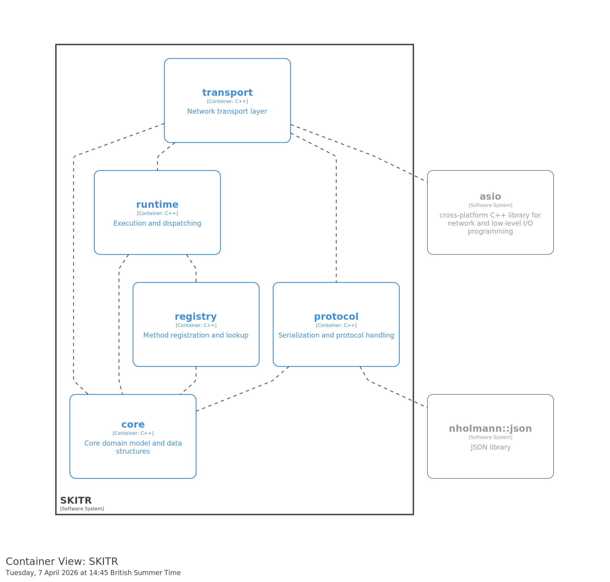
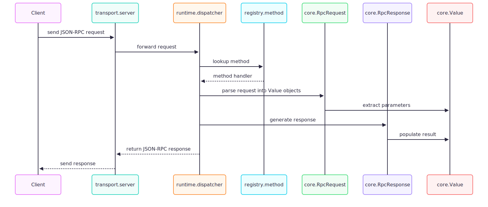
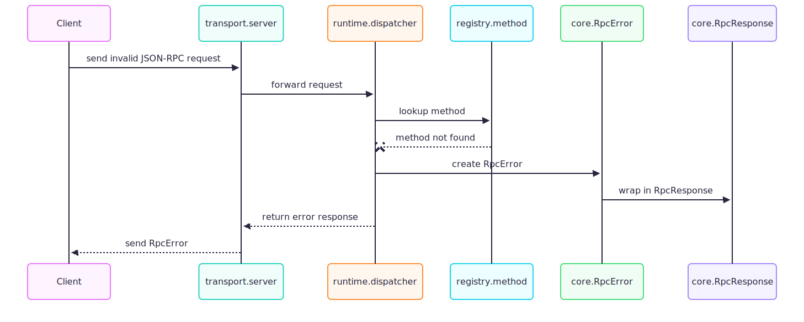
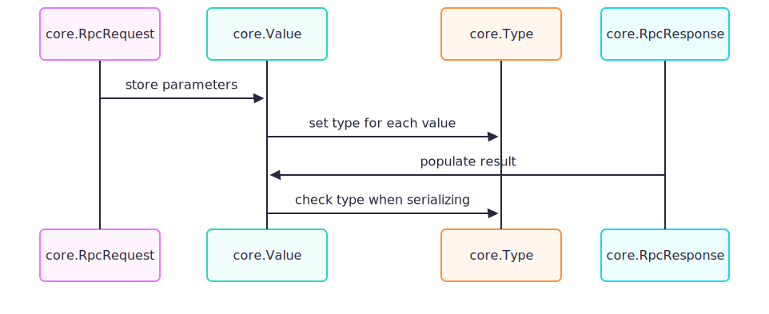
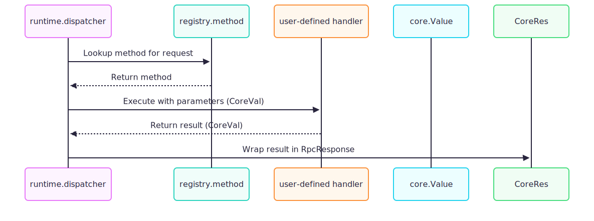

# SKITR Architecture

 **SKITR** - Structured Kernel for Interprocess Transport (RPC) - is a lightweight C++ framework implementing a JSON-RPC 2.0 server and client architecture.
 
## High-Level Architecture (C4)
The system is structured into 5 main containers:

1. **Core** - Domain model and JSON-RPC structures:
    - `Type` - Enumerates JSON value types (string, number, boolean, array, object).
    - `Value` - Represents any JSON value.
    - `RpcRequest` / `RpcResponse` - Structures for JSON-RPC requests and responses.
    - `RpcError` - Represents JSON-RPC error details.
2. **Protocol** - Handles serialization/deserialization:
    - `json_protocol` uses `nlohmann::json` to encode/decode JSON-RPC messages.
3. **Registry** - Registers and looks up JSON-RPC methods:
    - `method_registry` ensures thread-safe dispatch of method calls.
4. **Runtime** - Execution and dispatching:
    - `dispatcher` consumes requests, invokes registry methods, and prepares responses.
5. **Transport** - Abstracts communication channels:
    - `server` handles TCP connections and passes messages to the runtime.

### Dependencies

- **External libraries**:
    - [`asio`](https://think-async.com/Asio/) – Cross-platform networking and I/O.
    - [`nlohmann::json`](https://github.com/nlohmann/json) – JSON serialization/deserialization.

---

## Design Highlights
- **Separation of Concerns**: Clear boundaries between `core`, `protocol`, `registry`, `runtime`, and `transport`.
- **Extensibility**: New transports (e.g., WebSocket) can be added without modifying core logic.
- **Thread Safety**: The `method_registry` uses mutexes to ensure safe concurrent access.
- **Error Handling**: Comprehensive error structures and handling flows to ensure robust communication.

## Basic Request-Response Flow

## Error Handling Flow

## Value Parsing Flow

## Method Dispatch Flow

